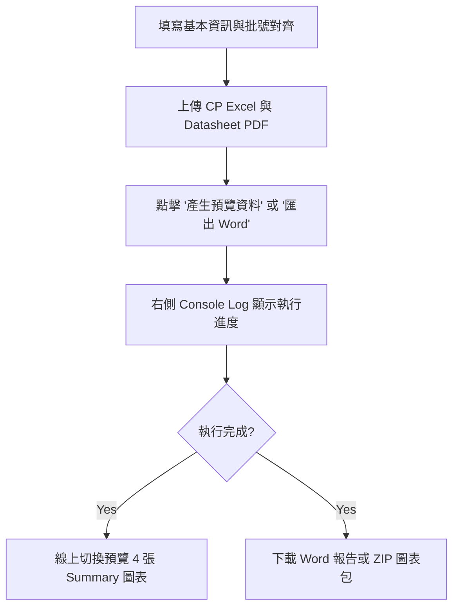

# ⚙️ 半導體工程實驗報告自動化系統 — Web 控制台

本目錄為「工程實驗報告自動化系統」的網頁版控制台介面（Web App），整合了前端視覺化控制面板與後端 Flask API 服務，讓使用者能以最直覺的圖形化介面完成報告的參數配置、資料上傳、任務監控與產物下載。

---

## 🎯 系統目的
本網頁應用的主要目的是**消除繁瑣的手工填表與報告排版工作**，提供以下核心價值：
1. **一鍵自動排版**：結合 [python-docx](https://python-docx.readthedocs.io/)，自動將測試數據與圖表填入指定格式的 Word 實驗報告中。
2. **圖表自動繪製**：後端自動解析 CP Summary 數據，繪製 NH/PH Split、NL/PL Split、GC CD Split 與 AA CD Split 等關鍵分析圖表。
3. **即時日誌監控**：前端可即時輪詢後端 Python Pipeline 執行日誌，方便故障排查。
4. **多格式產物匯出**：支援單獨下載 Word 報告、線上預覽關鍵圖表，或打包成 ZIP 檔一次下載所有圖表與報告。

---

## 🚀 本地開發與啟動指南

後端 Flask App 與報告生成核心模組（[gen_eng_report.py](file:///C:/D_BACKUP/AI_Project/Eng_AutoReport/App_AutoReport/gen_eng_report.py) 與 [cp_summary_report.py](file:///C:/D_BACKUP/AI_Project/Eng_AutoReport/App_AutoReport/cp_summary_report.py)）均已移至 `App_AutoReport` 資料夾內。

### 1. 安裝環境依賴
開啟終端機（如 PowerShell 或 Bash），確保切換至 `App_AutoReport` 目錄：
```bash
cd App_AutoReport
pip install -r requirements.txt
```

### 2. 啟動 Flask 伺服器
在 `App_AutoReport` 目錄下，執行以下指令啟動 Web 後端：
```bash
python app.py
```
> [!NOTE]
> 後端服務預設會監聽 `http://127.0.0.1:5000`。

### 3. 開啟網頁
在瀏覽器中輸入 `http://127.0.0.1:5000` 即可進入控制台中心。

---

## 💻 網頁介面操作指南

系統界面分為左側「**報告配置輸入區**」與右側「**狀態預覽與控制台**」。



### 📋 操作步驟說明

#### **第一步：填寫基本資訊**
* **Product No.**：晶片產品型號（例如 `FAG102B`）。
* **Function**：晶片主要功能描述（例如 `Serial Flash Memory`）。
* **主管 / 撰寫人**：填入簽核主管與報告撰寫人姓名。

#### **第二步：上傳必要資料與範本**
* **CP Summary Excel (必填)**：晶片的 CP 測試彙整數據表。
* **Datasheet PDF (必填)**：晶片的 Datasheet 文件，用於 Pipeline 中解析參考數據。
* **Corner CZ Summary Excel (選填)**：若有 Corner 實驗數據，可在此上傳。
* **封面範本 DOCX (選填)**：若未上傳，系統將預設使用根目錄下的 [封面.docx](file:///C:/D_BACKUP/AI_Project/Eng_AutoReport/封面.docx)。

#### **第三步：Mask 版本設定**
* 點擊「**+ 新增版本**」可新增 Mask Ver. 的對應描述，並使用單選鈕（Radio Button）指定哪一個是「**本次**」實驗的主力版本。

#### **第四步：批號記錄對齊**
* 在表格中填入 FAB（晶圓廠）、Lot No.（批號）、Mask Ver.（光罩版本）、Process Route（製程路徑）、WAT（Y/N）與 CP1（Y/N）。
* 確保此處填寫的批號與 CP Summary 內之批號命名一致，以利 Pipeline 進行關聯對齊。

#### **第五步：任務觸發與下載**
1. **產生預覽資料**：
   * 點擊後，右側日誌區會即時更新進度。完成後，將在「**圖表與產物預覽**」區渲染 NH/PH Split、NL/PL Split 等分頁圖表。
2. **匯出 Word**：
   * 直接生成並下載完整的 Word 報告。
3. **下載 charts + report (zip)**：
   * 打包下載所有生成的高解析度 PNG 圖表與 Word 報告檔。
